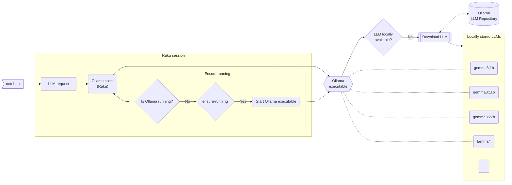

# WWW::Ollama

[](https://github.com/antononcube/Raku-WWW-Ollama/actions/workflows/macos.yml)
[](https://github.com/antononcube/Raku-WWW-Ollama/actions/workflows/linux.yml)
[](https://github.com/antononcube/Raku-WWW-Ollama/actions/workflows/windows.yml)
[](https://raku.land/zef:antononcube/WWW::Ollama)


Raku package for accessing [Ollama](https://ollama.com) models. (Ollama models can be run "locally" on user's computer.)

The implementation is based in the Ollama's API, [Ol1], and observing (and trying to imitate) the 
Ollama client of Wolfram Language (WL).

The package has the following features:

- If `ollama` is not running the corresponding executable is found and started
- If a request specifies the use of a known Ollama "local-evaluation" model, but that model is not available locally, then the model is downloaded first 

-----

## Installation

From GitHub:

```
zef install https://github.com/antononcube/Raku-WWW-Ollama.git
```

From [Zef ecosystem](https://raku.land):

```
zef install WWW::Ollama
```

-----

## Usage

Here is a list of usage design items:

- The Ollama access is done via a client object, `WWW::Ollama::Client`
- It is not necessary to use a `WWW::Ollama::Client` object explicitly
- Instead the following functions / subs can be used:
  - `ollama-base-url`
  - `ollama-list-models`
  - `ollama-model-info`
  - `ollama-embedding`
  - `ollama-completion`
  - `ollama-chat-completion`
  - `ollama-client` ("umbrella" function for all of the above)
- The Ollama functions -- and client methods -- take the named option "format"
  - With `format => 'hash'` more details of the request are obtained in Raku hashmap form
- The Ollama host and port can be explicitly specified when a new `WWW::Ollama::Client` object is created
- The method `WWW::Ollama::Client.new` takes the Boolean option (adverb) `:ensure-running`
  - Which is set to false by default, i.e. `:!ensure-running`

This diagram summarizes the Ollama client interaction (in this notebook):



### Usage examples

For detailed usage examples see:

- [Basic-usage.raku](./examples/Basic-usage.raku) (script)
- [Basic-usage.ipynb](./docs/Basic-usage.ipynb) (notebook)

-----

## CLI

The package provides the Command Line Interface (CLI) script `ollama-client` for making Ollama LLM generations.
Here is the usage message:

```shell
ollama-client --help
```

-----

## Design and implementation details

### Separate OOP and functional interfaces

- From the very beginning was decided to have an Object-Oriented Programming (OOP) implementation, not a Functional Programming (FP) one.
  - The implementations of ["WWW::OpenAI"](https://github.com/antononcube/Raku-WWW-OpenAI), ["WWW::Gemini"](https://github.com/antononcube/Raku-WWW-Gemini), etc. are FP-based or FP-inspired.
- A functional interface / front-end is, of course, desirable.
  - The functions `ollama-list-models`, `ollama-model-info`, `ollama-embedding`, `ollama-completion`, `ollama-chat-completion` use the umbrella function `ollama-client`.
  - The umbrella function `ollama-client`, in turn, has an optional argument `:$client` that takes `WWW::Ollama::Client` objects or `Whatever`.
    - If the value is `Whatever` then a new `WWW::Ollama::Client` object is created.

### Automatic start and download

- Initially, the idea was to have a "seamless" experience. (As in WL). In other words, these steps are automatic:
  - The running of the executable `ollama` is detected 
  - If not running, then the executable `ollama` is located and started
  - The LLM model specified in the request is downloaded (if not available already)
- From a certain sysadmin point of view the "seamless" run of `ollama` and model downloading is not that great.
  - Say, at a certain organization Jupyter notebooks that have "WWW::Ollama" setup are mass-deployed.
    - This might produce too much internet traffic because of the LLM models being downloaded.
  - So, now, by default, the automatic start is disabled if a `WWW::Ollama::Client.new()` is used.
    - To enable it, use `WWW::Ollama::Client.new(:ensure-running)`.
- Also, there was the idea to have the Ollama executables for different platforms to be part of the package. (Placed in "./resources".) 
  - But, that would make the package too big, ≈95MB.

-----

## TODO

- [ ] TODO Implementation
  - [X] DONE Reasonable gists for the different objects.
  - [ ] TODO Authorization
    - [X] DONE Initialize the client with an API key and use that key
    - [ ] TODO Pass & use an API key per client method call 
    - [ ] TODO Automatic discovery and use of OLLAMA_API_KEY 
  - [X] DONE Functional interface 
    - I.e. without the need to explicitly make a client object.
  - [ ] TODO Refactor
    - [ ] TODO Change the streaming method to use the output of "HTTP::Tiny"
    - [ ] TODO Review and simplify the code
      - There are, probably, too many classes.
- [ ] TODO CLI
  - [X] DONE MVP
  - [ ] TODO Detect JSON file with valid chat records
  - [ ] TODO Detect JSON string with valid chat records
- [X] DONE Unit tests
  - [X] DONE Client object creation 
  - [X] DONE Completion generation
  - [X] DONE Chat generation
  - [X] DONE Embeddings
- [ ] TODO Documentation
  - [X] DONE Basic usage script
  - [X] DONE Basic usage notebook
  - [X] DONE Using via the LLM-function framework
  - [ ] TODO Benchmarking over DSL translations
  - [ ] TODO Demo video

-----

## References

[Ol1] ["Ollama API"](https://github.com/ollama/ollama/blob/main/docs/api.md).
